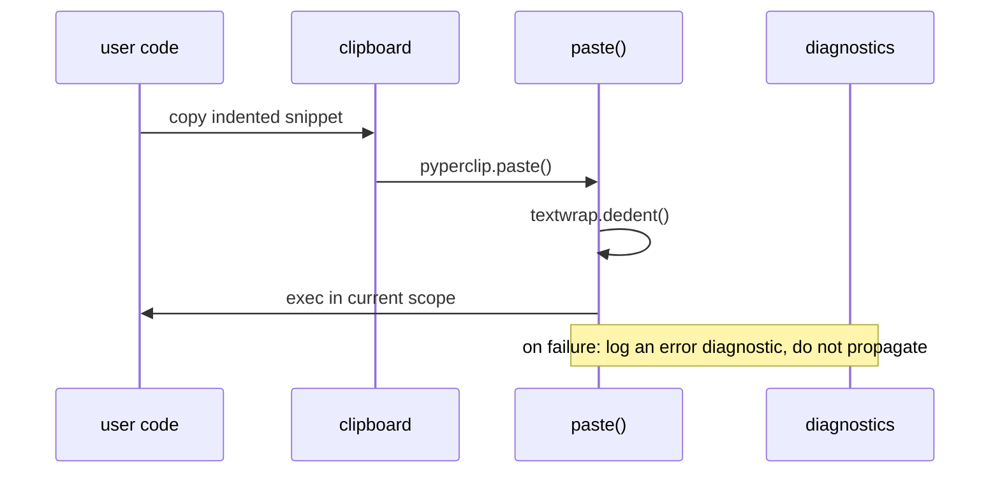
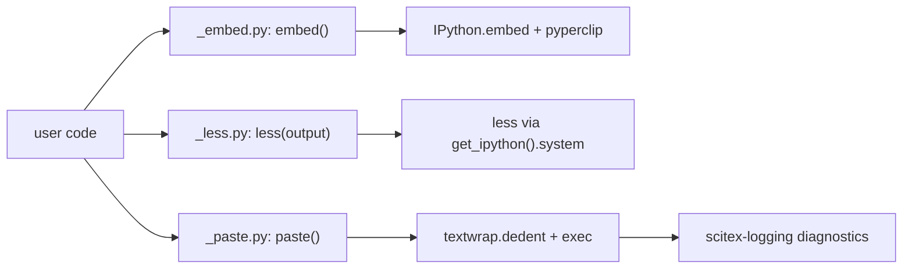

# scitex-repl

<p align="center">
  <a href="https://scitex.ai">
    
  </a>
</p>

<p align="center"><b>Interactive-REPL helpers (`embed`, `less`, `paste`) — clipboard-aware IPython workflows.</b></p>

<p align="center">
  <a href="https://scitex-repl.readthedocs.io/">Full Documentation</a> · <code>uv pip install scitex-repl[all]</code>
</p>

<!-- scitex-badges:start -->
<p align="center">
  <a href="https://pypi.org/project/scitex-repl/"></a>
  <a href="https://pypi.org/project/scitex-repl/"></a>
  <a href="https://scitex-repl.readthedocs.io/en/latest/"></a>
  <a href="https://www.gnu.org/licenses/agpl-3.0"></a>
</p>
<p align="center">
  <a href="https://github.com/ywatanabe1989/scitex-repl/actions/workflows/pytest-matrix-on-ubuntu-py3-11-3-12-3-13.yml"></a>
  <a href="https://github.com/ywatanabe1989/scitex-repl/actions/workflows/import-smoke-on-ubuntu-py3-12.yml"></a>
  <a href="https://codecov.io/gh/ywatanabe1989/scitex-repl"></a>
</p>
<!-- scitex-badges:end -->

---

## Problem and Solution

| # | Problem | Solution |
|---|---------|----------|
| 1 | **Clipboard code dies in transit** — pasting indented multi-line code from an editor into a REPL raises `IndentationError` | **`paste()`** — dedents the clipboard through `textwrap.dedent` before `exec`, and reports exec failures as diagnostics instead of propagating |
| 2 | **No clipboard-aware shell** — dropping into IPython loses whatever you just copied | **`embed()`** — starts `IPython.embed` with the clipboard preloaded and an optional execute-confirm prompt |
| 3 | **Paging needs a subshell** — viewing a long string from inside IPython means leaving the session | **`less()`** — pipes the string through the system `less` via the shell's `system` hook, cleaning up the temp file |

## Quick Start

```python
import scitex_repl

# Exec the current clipboard contents (dedented first).
scitex_repl.paste()

# Pipe a string through the system `less` pager.
scitex_repl.less("a very long string ...")

# Drop into an IPython shell, optionally pre-executing the clipboard.
scitex_repl.embed()
```

## Demo



<p align="center"><sub><b>Figure 1.</b> Copy-paste-run loop: the clipboard is dedented, executed in scope, and failures surface as diagnostics.</sub></p>

## Installation

```bash
uv pip install "scitex-repl[all]"
```

Through the umbrella: `uv pip install "scitex[repl]"`. Requires Python ≥ 3.9.

<details>
<summary><b>Per-extra installs</b></summary>

<br>

| Extra | Pulls in |
|---|---|
| `dev` | `pytest`, `pytest-cov`, `ruff`, `scitex-dev` |
| `docs` | `sphinx`, `sphinx-rtd-theme`, `myst-parser`, `sphinx-copybutton`, `sphinx-autodoc-typehints` |

</details>

## Architecture



<p align="center"><sub><b>Figure 2.</b> Three thin helpers over IPython and pyperclip: embed, page, and exec-with-diagnostics.</sub></p>

## 3 Interfaces

<details open>
<summary><strong>Python API</strong></summary>

<br>

```python
import scitex_repl

# Drop into an IPython shell, optionally pre-executing the clipboard.
scitex_repl.embed()

# Pipe a string through the system `less` pager.
scitex_repl.less("a very long string ...")

# Exec the current clipboard contents.
scitex_repl.paste()
```

</details>

## Status

- `less` and `paste` are functional thin wrappers over IPython /
  pyperclip.
- `embed` is preserved from the upstream — the upstream file was mostly
  commented-out scaffolding around a single small helper. A richer REPL
  bootstrapper can be layered on later if there's demand.

Ported out of `scitex_gen._ipython` as part of the scitex-gen full
retirement wave.

## Part of SciTeX

> `scitex-repl` is part of [**SciTeX**](https://scitex.ai). Install via
> the umbrella with `pip install scitex[repl]` to use as
> `scitex.repl` (Python) or `scitex repl ...` (CLI).

>Four Freedoms for Research
>
>0. The freedom to **run** your research anywhere — your machine, your terms.
>1. The freedom to **study** how every step works — from raw data to final manuscript.
>2. The freedom to **redistribute** your workflows, not just your papers.
>3. The freedom to **modify** any module and share improvements with the community.
>
>AGPL-3.0 — because we believe research infrastructure deserves the same freedoms as the software it runs on.

## License

AGPL-3.0-only (see [LICENSE](./LICENSE)).

---

<p align="center">
  <a href="https://scitex.ai" target="_blank"></a>
</p>
